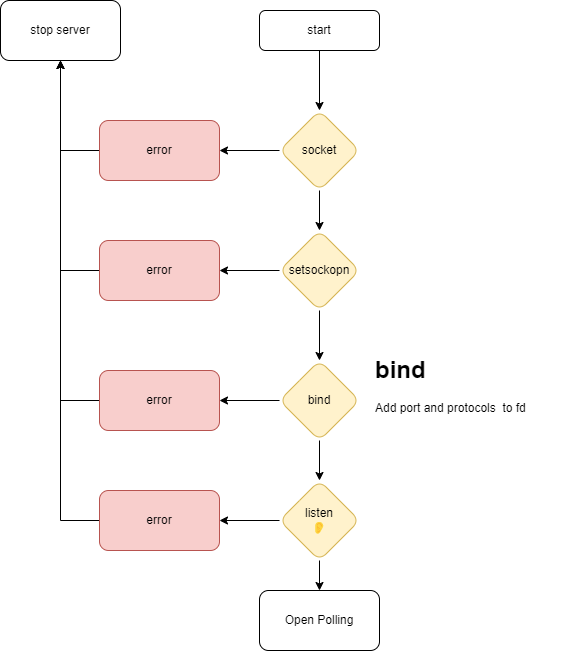

# ft_irc

## Socket Digram


to compile the project, run `make`

to run the server, run `./ircserv [port] [password]`


Test push 

## ft_IRC Commands available on this Server
### - Authentacation And Connection Commands:
- USER</br>
Used to identify the user to the server and provide additional information about the user. This command is typically used when connecting to an IRC server for the first time. </br>
-> Syntax:
```
/user <username> <hostname> <servername> <realname>
```
- NICK</br>
used to set or change a user's nickname. This command allows users to identify themselves on the network.</br>
-> Syntax:
```
/nick [new_nickname]
```
- PING</br>
used to check the connection between the user and the server. When a user issues a ping command, the server will respond with a pong message, indicating that the connection is still active.</br>
-> Syntax:
```
/ping <server1>
```
- PONG</br>
The pong command in IRC is used in response to a ping command from another user or server. It helps to ensure that the connection between the two parties is still active and functioning properly.</br>
-> Syntax:
```
/pong <daemon>
```
- QUIT</br>
used to disconnect from the server.</br>
-> Syntax:
```
/quit [<message>]
```

### - Channel Commands:
- JOIN</br>
used to join a specified channel on an IRC server.</br>
-> Syntax:
```
/join <channel>{,<channel>} [<key>{,<key>}]
```
- PART</br>
allows a user to leave a channel.</br>
-> Syntax:
```
/part <channel>{,<channel>}
```
- NAMES</br>
used to list the users currently in a specified channel.</br>
-> Syntax:
```
/names [<channel>{,<channel>}]
```
- PRIVMSG</br>
allows users to send private messages to other users or channels.</br>
-> Syntax:
```
/privmsg <receiver>{,<receiver>} <text to be sent>   ||   /msg <receiver>{,<receiver>} <text to be sent>
```
- NOTICE</br>
used to send a message to a user or channel that is not considered to be a part of the normal conversation.</br>
-> Syntax:
```
/notice <receiver>{,<receiver>} <text to be sent>
```
- INVITE (Operator Only)</br>
the invite command is used to invite a user to join a specific channel.</br>
-> Syntax:
```
/invite <nickname> <channel>
```
- KICK (Operator Only)</br>
The kick command in IRC is used to remove a user from a channel. This command can only be used by channel operators or those with the appropriate permissions.</br>
-> Syntax:
```
/kick <channel> <user> [<comment>]
```
- TOPIC (Operator Only)</br>
used to set or display the topic for a channel. When used without any arguments, it will display the current topic for the channel that the user is currently in.</br>
-> Syntax:
```
/topic <channel> [<topic>]
```
- MODE (Operator Only)</br>
used to set or modify the modes of a user or channel. Modes are settings that can be applied to users or channels to control their behavior and access. In brief, it is devided into two parts: user modes, and channel modes</br>
-> Syntax:

#### for channel mode:
```
/mode <channel> {[+|-]|o|p|s|i|t|n|b|v} [<limit>] [<user>] [<ban mask>]
```
### - Query Related Commands:
- WHOIS</br>
The whois command in IRC is used to display information about a specific user. When this command is used, the IRC server will return information such as the user's real name, hostname, and any channels they are currently a member of.</br>
-> Syntax:
```
/whois <nickname>
```
- LIST</br>
used to view a list of channels on the current server. When this command is executed, the server responds with a list of channels, along with information such as the topic and the number of users in each channel.</br>
-> Syntax:
```
/list [<channel>{,<channel>} [<server>]]
```
